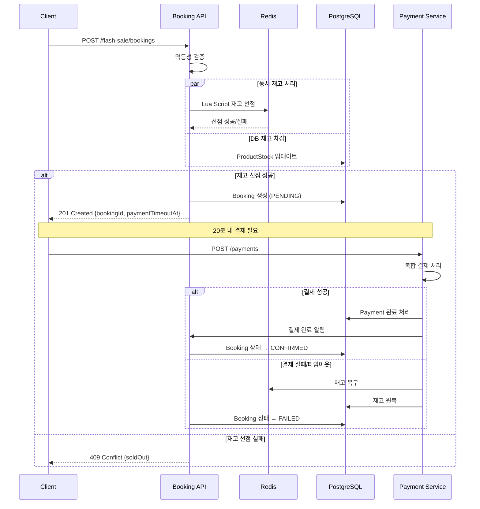
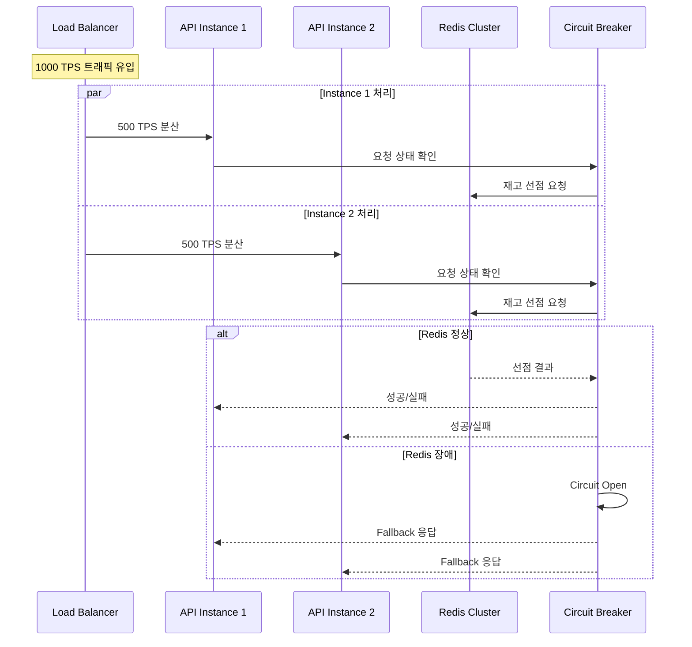
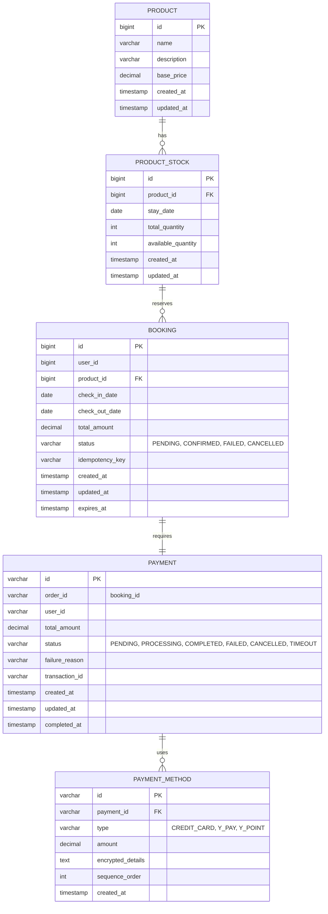

# 플래시 세일 예약 시스템

고가용성과 재고 정합성을 보장하는 플래시 세일 예약 시스템입니다.

## 📋 목차

- [시스템 아키텍처](#시스템-아키텍처)
- [핵심 기능](#핵심-기능)
- [실행 방법](#실행-방법)
- [API 명세](#api-명세)
- [시퀀스 다이어그램](#시퀀스-다이어그램)
- [ERD](#erd)

## 🏗️ 시스템 아키텍처

### 전체 아키텍처

```
┌─────────────────┐    ┌─────────────────┐    ┌─────────────────┐
│   Client Web    │    │   Load Balancer │    │   API Gateway   │
│   Application   │◄──►│     (nginx)     │◄──►│   (Optional)    │
└─────────────────┘    └─────────────────┘    └─────────────────┘
                                                         │
                       ┌─────────────────────────────────┘
                       │
           ┌─────────────────┐    ┌─────────────────┐
           │  Booking API    │    │  Payment API    │
           │   (Spring)      │◄──►│   (Spring)      │
           └─────────────────┘    └─────────────────┘
                       │                     │
           ┌─────────────────┐    ┌─────────────────┐
           │     Redis       │    │   PostgreSQL    │
           │ (재고 선점용)    │    │  (영속성 DB)    │
           └─────────────────┘    └─────────────────┘
```

### 레이어 아키텍처

```
┌─────────────────┐
│ Presentation    │  ← Controller, DTO
├─────────────────┤
│ Application     │  ← UseCase, Port
├─────────────────┤
│ Domain          │  ← Entity, Service, Policy
├─────────────────┤
│ Infrastructure  │  ← Repository, Adapter
└─────────────────┘
```

## 🎯 핵심 기능

### 1. 재고 정합성 및 공정성
- **Redis Lua Script**를 활용한 원자적 재고 선점
- **동시성 제어**로 미달/초과 판매 방지
- **FCFS(First Come First Served)** 기반 공정한 기회 제공

### 2. 고가용성 대응
- **Redis 기반 재고 선점** (50TPS → 1000TPS 급증 대응)
- **Connection Pool** 및 **Circuit Breaker** 패턴
- **비동기 처리** 및 **배압(Backpressure)** 제어

### 3. 멱등성 처리
- **Idempotency Key** 기반 중복 처리 방지
- **Redis TTL**을 활용한 자동 정리

### 4. 결제 확장성
- **Strategy Pattern** 기반 결제 수단 확장
- **복합 결제** 지원 (카드+포인트, 페이+포인트)
- **신규 결제 수단 추가 시 기존 코드 수정 최소화**

### 5. 장애 대응
- **Redis 장애 시 Fallback** 전략
- **결제 실패 시 자동 롤백**
- **20분 결제 타임아웃** 자동 처리

## 🚀 실행 방법

### 사전 요구사항

```bash
# Java 17 이상
java --version

# Redis 설치 및 실행
# macOS
brew install redis
brew services start redis

# Ubuntu
sudo apt update
sudo apt install redis-server
sudo systemctl start redis-server

# Windows
# Docker 사용 권장: docker run -d -p 6379:6379 redis:alpine
```

### 애플리케이션 실행

```bash
# 1. 프로젝트 클론
git clone <repository-url>
cd booking

# 2. 빌드
./gradlew clean build

# 3. 애플리케이션 실행
./gradlew :booking-rest:bootRun

# 4. 헬스체크
curl http://localhost:8080/health
```

### 환경 설정

```yaml
# application.yml
spring:
  redis:
    host: localhost
    port: 6379
    timeout: 2000ms
    lettuce:
      pool:
        max-active: 10
        max-idle: 5
        min-idle: 2

# JVM 옵션 (고성능 처리용)
-Xms2g -Xmx4g
-XX:+UseG1GC
-XX:MaxGCPauseMillis=200
```

## 📡 API 명세

### 플래시 세일 예약

```http
POST /api/flash-sale/bookings
Content-Type: application/json

{
    "userId": 12345,
    "productId": 1,
    "checkInDate": "2024-12-25",
    "checkOutDate": "2024-12-27",
    "totalAmount": 200000,
    "idempotencyKey": "user123-product1-20241225-uuid"
}

# 응답
{
    "bookingId": 789,
    "status": "PENDING",
    "paymentTimeoutAt": "2024-12-25T00:20:00"
}
```

### 복합 결제 처리

```http
POST /api/payments
Content-Type: application/json

{
    "orderId": "789",
    "userId": "12345",
    "totalAmount": 200000,
    "paymentMethods": [
        {
            "type": "CREDIT_CARD",
            "amount": 150000,
            "cardNumber": "1234-****-****-5678",
            "expiryDate": "12/25"
        },
        {
            "type": "Y_POINT",
            "amount": 50000,
            "availablePoints": 100000
        }
    ]
}
```

## 📊 시퀀스 다이어그램

### 플래시 세일 예약 프로세스



### 고가용성 트래픽 처리



## 🗄️ ERD

### 핵심 도메인 ERD



### 인덱스 전략

```sql
-- 재고 조회 최적화
CREATE INDEX idx_product_stock_lookup ON product_stock(product_id, stay_date);

-- 예약 조회 최적화  
CREATE INDEX idx_booking_user_status ON booking(user_id, status);
CREATE UNIQUE INDEX idx_booking_idempotency ON booking(idempotency_key);

-- 결제 타임아웃 처리 최적화
CREATE INDEX idx_payment_timeout ON payment(status, created_at);
CREATE INDEX idx_payment_order ON payment(order_id);

-- Redis 키 설계
-- 재고 선점: "flash-sale:{productId}:stock:{stayDate}"
-- 멱등성: "booking:idempotency:{key}" (TTL: 24h)
-- 유저 세션: "user:{userId}:session" (TTL: 30m)
```

## 🔧 모니터링 및 알람

### 핵심 메트릭

```yaml
# 성능 메트릭
- 응답시간 P99 < 500ms
- TPS 처리량 1000 이상
- 에러율 < 0.1%

# 비즈니스 메트릭  
- 재고 정합성 100% (미달/초과 판매 0건)
- 결제 성공률 > 95%
- 타임아웃 비율 < 5%

# 인프라 메트릭
- Redis 응답시간 < 1ms
- DB Connection Pool 사용률 < 80%
- Memory 사용률 < 70%
```

## 🚨 장애 대응

### Redis 장애 시나리오
1. **Circuit Breaker Open**: 3회 연속 실패 시 회로 차단
2. **Fallback 모드**: DB 기반 비관적 락으로 전환
3. **복구 감지**: Health Check로 Redis 상태 모니터링
4. **점진적 복구**: Half-Open → Closed 상태 전환

### 결제 실패 대응
1. **자동 롤백**: 부분 결제 성공 시 전체 취소
2. **재고 복구**: Redis + DB 재고 즉시 원복
3. **사용자 알림**: 실패 사유와 함께 안내
4. **재시도 로직**: 네트워크 오류 등 일시적 실패 시 3회 재시도

이 시스템은 **높은 동시성 상황에서도 재고 정합성을 100% 보장**하며, **확장 가능한 결제 시스템**과 **강력한 장애 대응 능력**을 제공합니다.